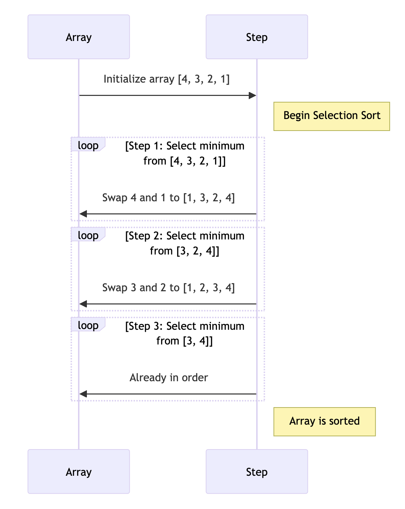

# 선택 정렬 (Selection Sort)

## 선택 정렬이란?

선택 정렬은 간단한 비교 기반 정렬 알고리즘입니다. 이 알고리즘은 배열에서 최소값(또는 최대값)을 찾아 선택한 다음, 배열의 맨 앞(또는 맨 뒤)과 교환하는 방식으로 정렬합니다. 선택 정렬은 구현이 간단하지만, 대규모 데이터셋에는 비효율적일 수 있습니다.

## 정렬 과정 설명 및 다이어그램
- 선택 정렬은 배열의 각 위치에 대해 나머지 부분에서 최소값을 찾아 현재 위치와 교환합니다. 이 과정은 배열의 모든 요소가 올바르게 정렬될 때까지 반복됩니다.



- 배열의 첫 번째 요소부터 시작하여 최소값을 찾습니다.
- 찾은 최소값을 현재 위치의 요소와 교환합니다.
- 다음 위치로 이동하여 위의 과정을 반복합니다.
- 전체 배열이 정렬될 때까지 이 과정을 반복합니다.

## 코드 예제 (Java)

```java
public class SelectionSort {
    public static void sort(int[] array) {
        int n = array.length;

        for (int i = 0; i < n-1; i++) {
            int minIndex = i;
            for (int j = i+1; j < n; j++) {
                if (array[j] < array[minIndex]) {
                    minIndex = j;
                }
            }

            // 최소값을 현재 위치와 교환
            int temp = array[minIndex];
            array[minIndex] = array[i];
            array[i] = temp;
        }
    }
}
```

## 시간 복잡도와 공간 복잡도
- 시간 복잡도: 모든 경우에 <b>O(n²)</b>
- 공간 복잡도: <b>O(1)</b> (부가적인 공간 사용이 없음)