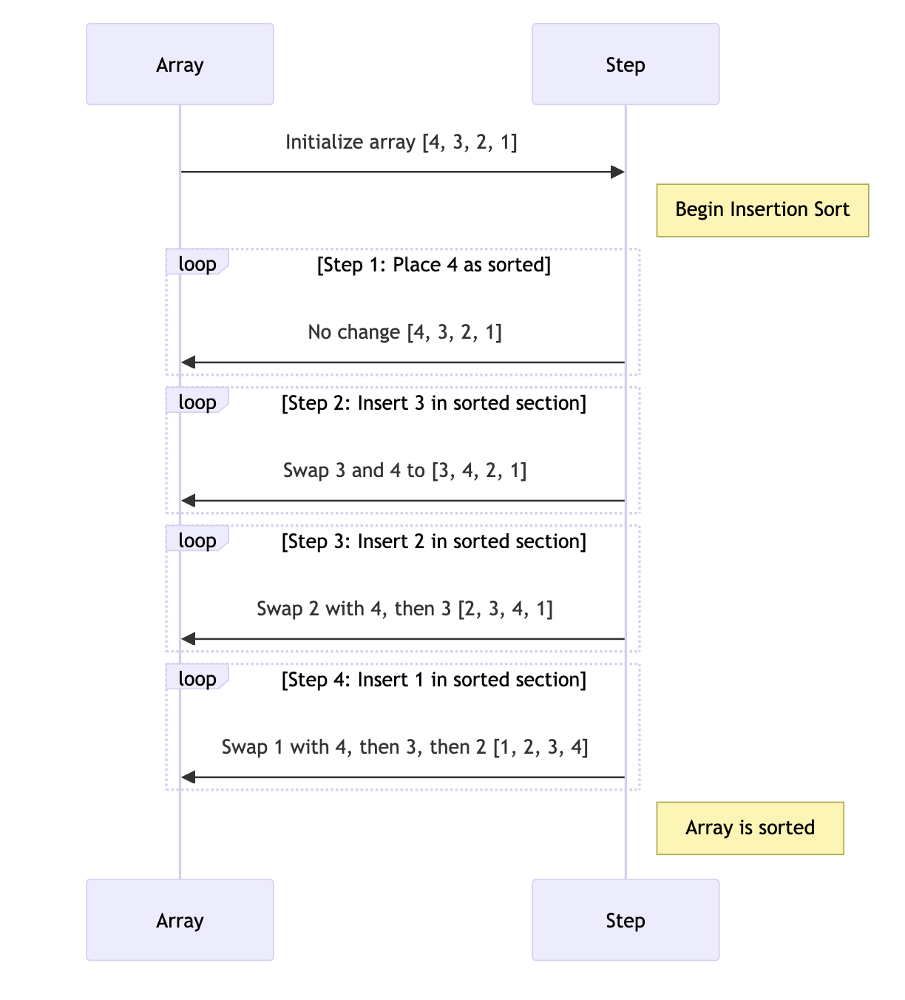

# 삽입 정렬 (Insertion Sort)

## 삽입 정렬이란?

삽입 정렬은 간단하고 직관적인 비교 기반 정렬 알고리즘입니다. 이 알고리즘은 각 반복에서 하나의 요소를 취하여 이미 정렬된 배열 부분에 적절한 위치에 삽입합니다. 삽입 정렬은 작은 데이터셋에 효율적이며, 이미 거의 정렬된 데이터에 대해서는 매우 빠릅니다.

## 정렬 과정 설명 및 다이어그램
- 삽입 정렬은 각 요소를 이미 정렬된 배열 부분에 적절한 위치에 삽입하는 방식으로 정렬합니다. 이 과정은 배열의 모든 요소가 올바르게 정렬될 때까지 반복됩니다.



- 배열의 두 번째 요소부터 시작하여 현재 요소를 이미 정렬된 부분과 비교합니다.
- 현재 요소가 정렬된 부분의 요소보다 작으면, 적절한 위치를 찾을 때까지 정렬된 부분의 요소들을 오른쪽으로 이동시킵니다.
- 적절한 위치를 찾으면 현재 요소를 그 위치에 삽입합니다.
- 다음 요소로 이동하여 위의 과정을 반복합니다.

## 코드 예제 (Java)

```java
public class InsertionSort {
    public static void sort(int[] array) {
        int n = array.length;
        for (int i = 1; i < n; ++i) {
            int key = array[i];
            int j = i - 1;

            // 정렬된 부분의 요소들을 오른쪽으로 이동시키면서 적절한 위치 찾기
            while (j >= 0 && array[j] > key) {
                array[j + 1] = array[j];
                j = j - 1;
            }
            array[j + 1] = key;
        }
    }
}
```
## 시간 복잡도와 공간 복잡도
- 시간 복잡도: 최악의 경우 <b>O(n²)</b>, 최선의 경우 <b>O(n)</b>
- 공간 복잡도: <b>O(1)</b> (부가적인 공간 사용이 없음)