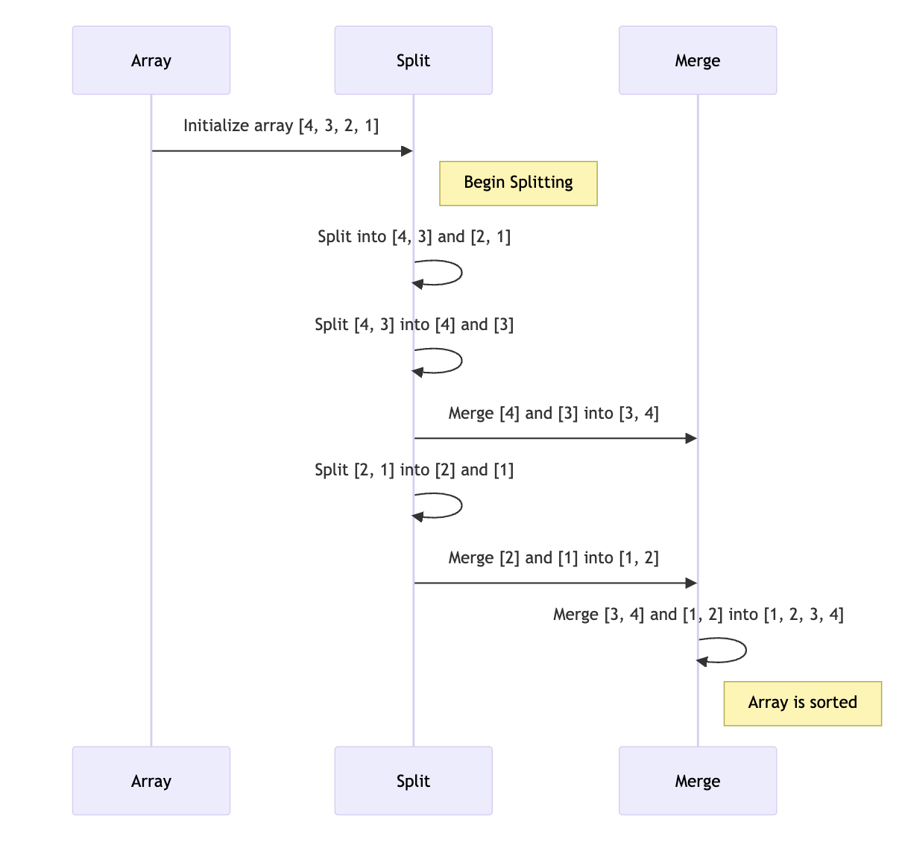

# 병합 정렬 (Merge Sort)

## 병합 정렬이란?

병합 정렬은 효율적인 비교 기반 정렬 알고리즘입니다. 이 알고리즘은 '분할 정복' 방법을 사용하여 배열을 반으로 나누고, 각 부분을 재귀적으로 정렬한 다음 병합합니다. 병합 정렬은 대규모 데이터셋에 효과적이며 안정적인 정렬 방법입니다.

## 정렬 과정 설명 및 다이어그램
- 병합 정렬은 배열을 반으로 나누고 각 부분을 재귀적으로 정렬한 다음, 두 부분을 병합하여 전체 배열을 정렬합니다. 이 과정은 배열이 완전히 정렬될 때까지 반복됩니다.



- 배열을 반으로 나눕니다.
- 각 부분을 재귀적으로 정렬합니다.
- 정렬된 부분들을 병합합니다.
- 전체 배열이 정렬될 때까지 이 과정을 반복합니다.

## 코드 예제 (Java)

```java
public class MergeSort {

    public static void mergeSort(int[] array, int left, int right) {
        if (left < right) {
            int middle = (left + right) / 2;

            mergeSort(array, left, middle);
            mergeSort(array, middle + 1, right);

            merge(array, left, middle, right);
        }
    }

    private static void merge(int[] array, int left, int middle, int right) {
        int[] leftArray = new int[middle - left + 1];
        int[] rightArray = new int[right - middle];

        for (int i = 0; i < leftArray.length; i++)
            leftArray[i] = array[left + i];
        for (int i = 0; i < rightArray.length; i++)
            rightArray[i] = array[middle + 1 + i];

        int leftIndex = 0, rightIndex = 0;

        int k = left;
        while (leftIndex < leftArray.length && rightIndex < rightArray.length) {
            if (leftArray[leftIndex] <= rightArray[rightIndex]) {
                array[k] = leftArray[leftIndex];
                leftIndex++;
            } else {
                array[k] = rightArray[rightIndex];
                rightIndex++;
            }
            k++;
        }

        while (leftIndex < leftArray.length) {
            array[k] = leftArray[leftIndex];
            leftIndex++;
            k++;
        }

        while (rightIndex < rightArray.length) {
            array[k] = rightArray[rightIndex];
            rightIndex++;
            k++;
        }
    }
}
```

## 시간 복잡도와 공간 복잡도
- 시간 복잡도: 모든 경우에 <b>O(n log n)</b>
- 공간 복잡도: <b>O(n)</b> (부가적인 배열 사용)
