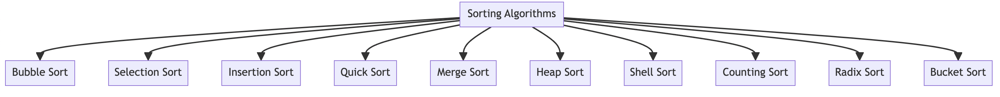

# 정렬 알고리즘에 대한 개요 

--- 

- 자바에서의 정렬 알고리즘은 리스트나 배열의 요소들을 특정 순서대로 배열하는 방법입니다. 이 순서는 보통 숫자 순서나 사전식 순서로 정렬됩니다. 정렬 알고리즘은 데이터를 조직하고 데이터 처리 작업의 효율성을 향상시키는 데 필수적입니다.

 

 

 

## 자바에서 사용되는 주요 정렬 알고리즘

--- 

1. 버블 정렬 <b>(Bubble Sort)</b>: 인접한 요소들을 비교하고 교환하는 간단한 방식의 정렬 알고리즘입니다. 효율성은 낮지만 구현이 매우 간단합니다.

2. 선택 정렬 <b>(Selection Sort)</b>: 배열의 최소값(또는 최대값)을 찾아 선택한 다음, 배열의 맨 앞(또는 맨 뒤)과 교환하는 방식으로 정렬합니다.

3. 삽입 정렬 <b>(Insertion Sort)</b>: 각 요소를 이미 정렬된 배열 부분에 적절한 위치에 삽입하는 방식으로 정렬합니다.

4. 퀵 정렬 <b>(Quick Sort)</b>: 피벗을 기준으로 배열을 분할하고, 각 부분을 재귀적으로 정렬하는 방식입니다. 대규모 데이터에 효과적입니다.

5. 병합 정렬 <b>(Merge Sort)</b>: 배열을 반으로 나누고, 각 부분을 재귀적으로 정렬한 다음 병합합니다. 대규모 데이터에 효율적인 안정적인 정렬 방법입니다.

6. 힙 정렬 <b>(Heap Sort)</b>: 힙 자료구조를 사용하여 배열을 정렬하는 방법입니다. 효율적인 메모리 사용과 안정적인 성능을 제공합니다.

7. 셸 정렬 <b>(Shell Sort)</b>: 삽입 정렬을 개선한 버전으로, 먼저 큰 간격으로 요소들을 정렬한 후 점차 간격을 줄여가며 정렬합니다.

8. 계수 정렬 <b>(Counting Sort)</b>: 요소의 발생 횟수를 계산하여 정렬하는 방식으로, 정수나 특정 범위의 숫자에 적합합니다.

9. 기수 정렬 <b>(Radix Sort)</b>: 숫자의 각 자릿수를 기준으로 정렬하는 방식입니다.

10. 버킷 정렬 <b>(Bucket Sort)</b>: 데이터를 여러 버킷(그룹)으로 나눈 후 각 버킷을 개별적으로 정렬하는 방식입니다.

 

## 정렬 알고리즘의 선택

---

### 정렬 알고리즘을 선택할 때 고려해야 할 요소는 다음과 같습니다:

- 데이터의 크기와 종류: 작은 데이터셋의 경우 간단한 알고리즘(예: 버블 정렬)이 효과적일 수 있습니다. 큰 데이터셋의 경우 퀵 정렬이나 병합 정렬이 더 적합합니다.
- 알고리즘의 복잡성: 간단한 알고리즘은 구현하기 쉽지만, 효율성이 낮을 수 있습니다. 복잡한 알고리즘은 더 빠른 성능을 제공할 수 있지만 구현이 어려울 수 있습니다.
- 안정성: 안정적인 정렬 알고리즘은 동일한 값을 가진 요소의 상대적인 순서를 유지합니다.